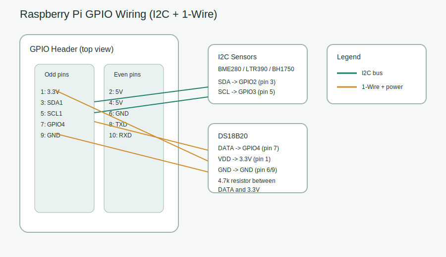
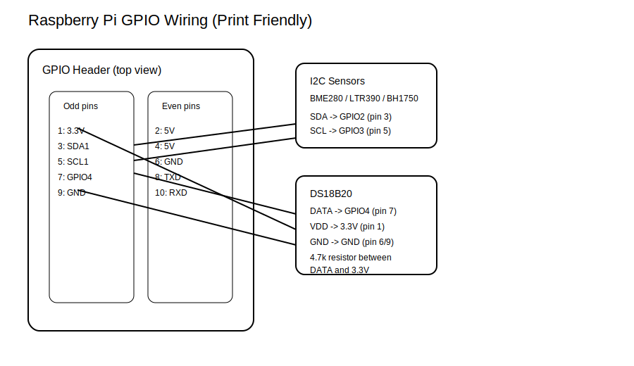

# Hardware Wiring Guide

This guide explains how to wire supported sensors to a Raspberry Pi GPIO header.
All sensors in this project use 3.3V logic. Do not connect them to 5V pins.

## Supported sensors
- BME280 (temperature, humidity, pressure) via I2C
- LTR390 (UV index + ALS) via I2C
- BH1750 (ambient light) via I2C
- DS18B20 (temperature probe) via 1-Wire

## Before you start
1. Enable I2C and 1-Wire on the Pi.
   - `sudo raspi-config` -> Interface Options -> I2C, 1-Wire.
2. Reboot the Pi after enabling.

## Wiring diagram
Color overview:


Print-friendly (black and white):


## Quick pinout (printable)
| Function | BCM GPIO | Physical pin |
| --- | --- | --- |
| 3.3V | n/a | 1 or 17 |
| GND | n/a | 6, 9, 14, 20, 25, 30, 34, 39 |
| I2C SDA1 | GPIO2 | 3 |
| I2C SCL1 | GPIO3 | 5 |
| 1-Wire data | GPIO4 | 7 |

## GPIO pin reference
| Function | BCM GPIO | Physical pin | Notes |
| --- | --- | --- | --- |
| 3.3V | n/a | 1 or 17 | Power for sensors |
| GND | n/a | 6, 9, 14, 20, 25, 30, 34, 39 | Ground |
| I2C SDA1 | GPIO2 | 3 | Shared data line |
| I2C SCL1 | GPIO3 | 5 | Shared clock line |
| 1-Wire data | GPIO4 | 7 | Default DS18B20 data pin |

<details>
<summary>Full 40-pin header reference (physical pin -> BCM)</summary>

| Physical pin | Function | BCM GPIO | Notes |
| --- | --- | --- | --- |
| 1 | 3.3V | n/a | Power |
| 2 | 5V | n/a | Power |
| 3 | SDA1 | GPIO2 | I2C data |
| 4 | 5V | n/a | Power |
| 5 | SCL1 | GPIO3 | I2C clock |
| 6 | GND | n/a | Ground |
| 7 | GPIO4 | GPIO4 | 1-Wire data |
| 8 | TXD0 | GPIO14 | UART |
| 9 | GND | n/a | Ground |
| 10 | RXD0 | GPIO15 | UART |
| 11 | GPIO17 | GPIO17 | General I/O |
| 12 | GPIO18 | GPIO18 | PWM0 |
| 13 | GPIO27 | GPIO27 | General I/O |
| 14 | GND | n/a | Ground |
| 15 | GPIO22 | GPIO22 | General I/O |
| 16 | GPIO23 | GPIO23 | General I/O |
| 17 | 3.3V | n/a | Power |
| 18 | GPIO24 | GPIO24 | General I/O |
| 19 | MOSI | GPIO10 | SPI |
| 20 | GND | n/a | Ground |
| 21 | MISO | GPIO9 | SPI |
| 22 | GPIO25 | GPIO25 | General I/O |
| 23 | SCLK | GPIO11 | SPI |
| 24 | CE0 | GPIO8 | SPI |
| 25 | GND | n/a | Ground |
| 26 | CE1 | GPIO7 | SPI |
| 27 | ID_SD | GPIO0 | Reserved for HAT EEPROM |
| 28 | ID_SC | GPIO1 | Reserved for HAT EEPROM |
| 29 | GPIO5 | GPIO5 | General I/O |
| 30 | GND | n/a | Ground |
| 31 | GPIO6 | GPIO6 | General I/O |
| 32 | GPIO12 | GPIO12 | PWM0 |
| 33 | GPIO13 | GPIO13 | PWM1 |
| 34 | GND | n/a | Ground |
| 35 | GPIO19 | GPIO19 | PWM1 |
| 36 | GPIO16 | GPIO16 | General I/O |
| 37 | GPIO26 | GPIO26 | General I/O |
| 38 | GPIO20 | GPIO20 | PCM DIN |
| 39 | GND | n/a | Ground |
| 40 | GPIO21 | GPIO21 | PCM DOUT |

</details>

## I2C wiring (BME280, LTR390, BH1750)
All I2C sensors share the same SDA/SCL lines. Wire each board like this:

| Sensor pin | Pi pin |
| --- | --- |
| VIN / VCC | 3.3V |
| GND | GND |
| SDA | GPIO2 (SDA1, pin 3) |
| SCL | GPIO3 (SCL1, pin 5) |

### I2C addresses
Use `i2cdetect -y 1` to verify each address.

| Sensor | Default address | Alternate address | How to change |
| --- | --- | --- | --- |
| BME280 | 0x76 | 0x77 | Tie SDO to 3.3V for 0x77 |
| LTR390 | 0x53 | n/a | Fixed on most breakouts |
| BH1750 | 0x23 | 0x5C | Tie ADDR to 3.3V for 0x5C |

## DS18B20 wiring (1-Wire)
The DS18B20 requires a pull-up resistor from data to 3.3V.

| Sensor wire | Pi pin |
| --- | --- |
| VDD (red) | 3.3V |
| GND (black) | GND |
| DATA (yellow/white) | GPIO4 (pin 7) |

Add a 4.7k resistor between 3.3V and DATA:

```
3.3V ---[4.7k]--- DATA --- GPIO4
GND ---------------------- GND
```

If you use multiple DS18B20 probes, connect all DATA wires to the same GPIO4
and keep a single 4.7k pull-up resistor on the bus.

## Verify hardware
Run these checks after wiring:

```
sudo i2cdetect -y 1
ls /sys/bus/w1/devices/
```

Expected results:
- `i2cdetect` shows BME280, LTR390, and BH1750 addresses.
- `w1` devices show one or more `28-xxxxxxxxxxxx` entries.

## Notes for sensor placement
- Keep I2C cable runs short and avoid parallel runs with high-power lines.
- Use shielded or twisted wires if you must extend beyond 30-40 cm.
- Place UV sensors where the lamp shines, and humidity sensors away from misting spray.

## Next steps
Configure the sensor agent to match your wiring in `agent/config.yaml`.
